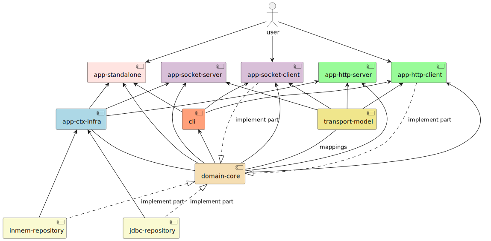

# Flight Management System

This project is developed using Gradle as the build tool and follows a layered architecture comprising Model, Repository, Service, and UI layers, designed to embrace Java's OOP principles.

The core functionality revolves around managing flight operations, including the ability to:

* Add an airplane
* Add a flight
* Add a scheduled flight
* Add a booking

Data is stored either:
* in [memory](inmem-repository/src/main/java/ro/eduardismund/flightmgmt/repo/InmemFlightManagementRepository.java)
  * with [file serialization](inmem-repository/src/main/java/ro/eduardismund/flightmgmt/repo/JavaSerializationFlightManagementPersistenceManager.java), demonstrating the persistence of information through serialization and deserialization processes.
* in [RDBMS](jdbc-repository/src/main/java/ro/eduardismund/flightmgmt/repo/JdbcFlightManagementRepository.java)
  * in order to initialize MS SQL Server Database run the scripts: [database.sql](sql/database.sql), [schema.sql](sql/schema.sql)

Gradle integrates tools like Checkstyle, PMD, Spotless, and SpotBugs to ensure code quality, adherence to standards, and maintainability.

The project features comprehensive testing with 100% coverage. Mocking is utilized to independently verify each functionality, while Pitest is employed for mutation testing, ensuring robust feature verification and improving code reliability.

The [build.gradle](build.gradle) has the following features:
* __Plugins__: Includes necessary plugins for building, testing, code analysis, and formatting: java, application, jacoco, checkstyle, pmd, Pitest, Spotless, SpotBugs.
* __Pitest__: Configured for mutation testing with a 100% mutation coverage , targeting the specified classes and generating reports in HTML format.
* __Dependencies__: Includes __Lombok__ for boilerplate reduction, JUnit and Mockito for testing, and FindBugs for static analysis.
* __Testing__: Configures __JUnit 5__ for testing and ensures code coverage reporting via JaCoCo.
* __Checkstyle__ and __PMD__: Configured for static code analysis, with PMD allowing failures to be ignored.
* __SpotBugs__: Configures HTML report generation for both main and test tasks.
* __Spotless__: Ensures consistent code formatting using Palantir’s Java formatter and removes unused imports.
* __JaCoCo__: Excludes certain directories from coverage reports and enforces 100% coverage verification.#

# Software Architecture

The application can be run in 3 modes:
  * **Standalone mode**, with direct connection to the underlying storage (file backed in memory or JDBC)
  * **TCP Socket Client-Server mode**, which involves launching a server connected to the underlying storage, and the client which will connect to the server on the TCP Socket
  * **HTTP Client-Server mode**, which involves launching a HTTP server serving RESTful API and client consuming the REST API

**Spring Framework** is used as a dependency injection container. At this point the application uses the simpler `GenericApplicationContext`, implementation of `ApplicationContext`.

## HTTP Client-Server Mode

Is available through the [app-http-server](app-http-server) and [app-http-client](app-http-client) modules.

The Server launches an embedded **Apache Tomcat** web server and the API is implemented by means of `HttpServlets`.

The REST API uses XML for data transport. For these, the app-http-server and app-http-client modules, both make use of [transport-model](transport-model) and JAXB.

## TCP Client-Server Mode

Is available through the [app-socket-server](app-socket-server) and [app-socket-client](app-socket-client) modules.

The Client and the Server communicate through a protocol based on XML commands. Commands are separated by new lines.

The communication protocol uses XML for data transport. For these, the app-socket-server and app-socket-client modules, both make use of [transport-model](transport-model) and JAXB.

## Standalone Mode

Is available through the [app-standalone module](app-standalone)

## Common modules

### Domain Core

The [domain-core module](domain-core) contains the business logic and domain model. The business logic is implemented in the [DefaultFlightManagementService](domain-core/src/main/java/ro/eduardismund/flightmgmt/service/DefaultFlightManagementService.java)
which implements the [FlightManagementService interface](domain-core/src/main/java/ro/eduardismund/flightmgmt/service/FlightManagementService.java) using the [FlightManagementRepository interface](domain-core/src/main/java/ro/eduardismund/flightmgmt/repo/FlightManagementRepository.java).
The domain model is contained in the [ro.eduardismund.flightmgmt.domain package](domain-core/src/main/java/ro/eduardismund/flightmgmt/domain).

`FlightManagementRepository` interface does not have an implementation in this module. We rely on **dependency inversion** for injecting repository into the `DefaultFlightManagementService`

### Command Line Interface

The [cli module](cli) implements a Command Line Interface using the FlightManagementService. It is then used by the user facing modules(app-standalone, app-socket-client, app-http-client).

### Repositories

We provide two implementations of the `FlightManagementRepository` interface specified in the `domain-core`:
* an _in memory_ one, implemented in the [inmem-repository module](inmem-repository) 
* a _JDBC based_ one, implemented in the [jdbc-repository module](jdbc-repository) 

#### In memory repository

One of the two implementations of the `FlightManagementRepository` interface from the `domain-core` is [InmemFlightManagementRepository](inmem-repository/src/main/java/ro/eduardismund/flightmgmt/repo/InmemFlightManagementRepository.java),
which keeps the domain entities in memory at runtime and makes them available throughout runs by means of the [InmemFlightPersistenceManager interface](inmem-repository/src/main/java/ro/eduardismund/flightmgmt/repo/InmemFlightManagementPersistenceManager.java)
which abstracts a strategy for serializing and deserializing the domain entities.

This module also provides an implementation for the `InmemFlightPersistenceManager` that uses a file backed storage using Java serialization in [JavaSerializationFlightManagementPersistenceManager](inmem-repository/src/main/java/ro/eduardismund/flightmgmt/repo/JavaSerializationFlightManagementPersistenceManager.java).

#### JDBC-based repository

The other implementation of the `FlightManagementRepository` interface from the `domain-core` is [JdbcFlightManagementRepository](jdbc-repository/src/main/java/ro/eduardismund/flightmgmt/repo/JdbcFlightManagementRepository.java),
which uses JDBC. It depends on a `DataSource` instance (dependency inversion).

### Transport model

Contains DTO's, some of them are commands, some of them are responses and the others participate in both commands and responses.

Besides the DTO's this module contains an [XML Manager](transport-model/src/main/java/ro/eduardismund/flightmgmt/dtos/XmlManager.java) which provides marshal and unmarshal operations implemented by means of `JAXB`.

### App context infrastructure

Provides several suppliers of implementations that need to be injected into the different application modes.

* [EnvironmentSupplier](app-ctx-infra/src/main/java/ro/eduardismund/flightmgmt/app/EnvironmentSupplier.java) provides a `ConfigurableEnvironment`(from Spring Framework) implementation, which has as property source a file `config/application.properties`. Properties defined in this file can be overwritten by a JVM System properties.
* [DataSourceSupplier](app-ctx-infra/src/main/java/ro/eduardismund/flightmgmt/app/DataSourceSupplier.java) provides a `DataSource` implementation that allows to connect to an MS SQL sever.
* [FlightManagementRepositorySupplier](app-ctx-infra/src/main/java/ro/eduardismund/flightmgmt/app/FlightMgmtRepositorySupplier.java) provides a `FlightManagementRepository` implementation which is either the `in memory` or the `jdbc` one, depending on the `repository`environment property.
* [FlightManagementRepositoryInitApplicationListener](app-ctx-infra/src/main/java/ro/eduardismund/flightmgmt/app/FlightMgmtRepositoryInitApplicationListener.java) is a Spring framework context event listener, which calls the `init` method on the `FlightManagementRepository`.

### Technology Stack

The application uses the following frameworks and libraries

* Spring Framework
  * Currently we only use the `spring-context` module
* `tomcat-embedded-core` as embedded servlet container (web server)
* `mssql-jdbc` as JDBC driver for MS SQL Server
* `jaxb-runtime` from `glassfish` as a JAXB implementation
* `lombok` annotation processor at compile time
